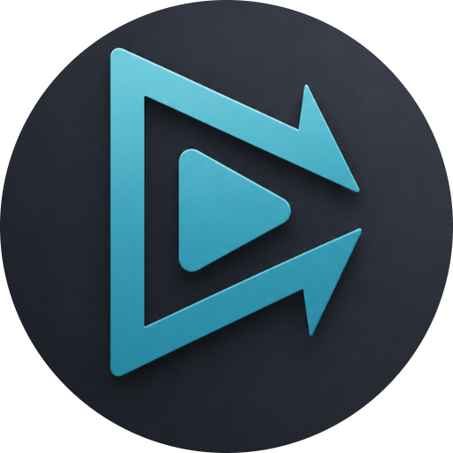
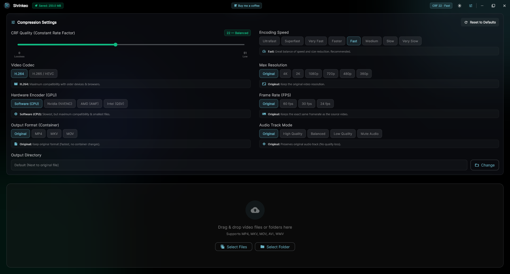
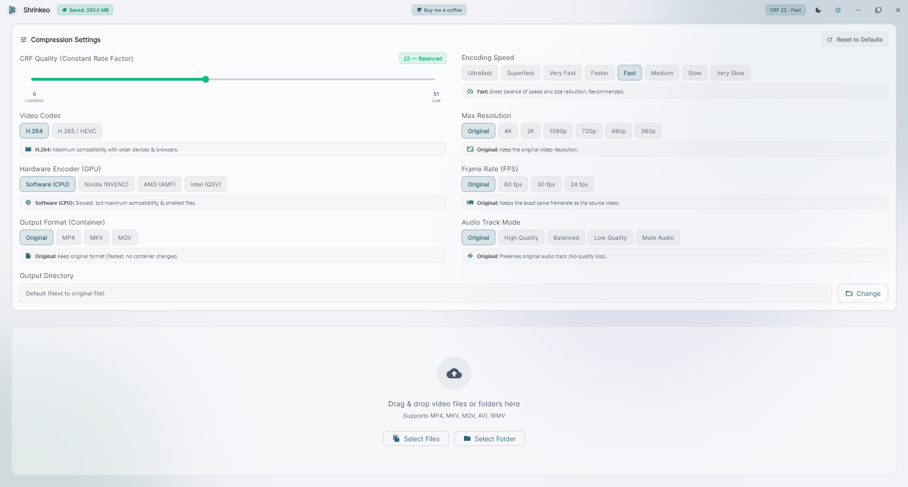

  
   
  
  

  
<b>Offline Video & Image Compression Suite for Windows. High Quality. Precise. Private.</b>

  

    
    
  

  
    

  
Shrinkeo is an offline, privacy-first video and image compression suite for Windows. Designed for high visual fidelity and granular control, Shrinkeo lets you compress videos by exact target size (2-Pass VBR) or CRF, export GIFs/MP3, trim clips, denoise audio/video, normalize speech volume, and optimize photos with a dedicated Image Suite (MozJPEG, pngquant, WebP, AVIF, and KB target size)—all processed locally on your machine with zero cloud uploads.

---

## 🛑 The Problem
Media files are massive. Sharing 4K videos and high-res camera photos on WhatsApp, Discord, or email is painful. Online compressors force you to upload your sensitive personal files to remote servers, slap watermarks on your media, and demand monthly subscriptions when your file exceeds a tiny limit.

## 💡 The Approach
**Shrinkeo** operates 100% locally on your PC. Drag and drop your videos and photos to optimize them using industry-standard open-source engines (FFmpeg, MozJPEG, cwebp, pngquant), wrapped in a clean, modern interface with fine-tuned precision controls.

---

## 🛠️ Feature Breakdown

Shrinkeo provides fine-grained control over compression and encoding across five dedicated tabs:

### 🖼️ Image Compression Suite
*   🎯 **Target Size (KB) & Quality Modes**: Set a precise maximum file size (e.g. **500 KB for web uploads** or **200 KB for email attachments**) using automated binary-search optimization, or dial in custom quality levels.
*   ⚡ **Preset Profiles**: One-click presets for **Smart Auto** (balanced quality and compression), **Max Savings** (aggressive size reduction), and **Ultra Fidelity** (preserves raw image details for archival).
*   📦 **Next-Gen Image Formats**: Convert seamlessly between **PNG**, **JPEG**, **WebP**, and next-gen **AVIF**.
*   🔬 **Advanced Quantization**: State-of-the-art **PNG quantization (pngquant)** reducing 24-bit/32-bit PNGs down to 8-bit palette images with full alpha transparency.
*   📐 **Dimension Downscaling**: Smartly scale photos down to **4K Max (3840px)**, **Full HD (1920px)**, **HD (1280px)**, or **SD (854px)** while preserving original aspect ratios.
*   🛡️ **EXIF & GPS Camera Privacy**: Strip sensitive location, GPS coordinates, and camera metadata before sharing photos online.

### 🎬 Video Engine
*   🎯 **Target Size (MB) & CRF Modes**: Specify an exact target size (e.g. **25 MB for Discord** or **10 MB for Email**) powered by 2-Pass VBR rate control, or visually tune quality using the **CRF (Constant Rate Factor)** slider.
*   ⚡ **Hardware & CPU Encoding**: Harness your dedicated graphics card with **NVIDIA (NVENC)**, **AMD (AMF)**, or **Intel (QSV)** acceleration, or choose optimized **Software (CPU)** encoding.
*   🎥 **Modern Codec Support**: Compress using **AV1**, **H.265 (HEVC)**, **H.264**, or **VP9**.
*   🚀 **Web-Optimized MP4 FastStart**: Automatically relocates MP4 header metadata (`-movflags +faststart`) so your exported videos stream instantly in browsers without downloading the entire file.
*   🎬 **Quick Editing & Tools**: Export directly to **Animated GIF**, extract audio to **MP3 (320kbps)**, **AAC**, or **WAV**, trim lossless clips (`HH:MM:SS`), adjust speed (`0.5x` to `4.0x`), and auto-crop black bars.
*   📐 **Custom Aspect Ratios & Rotation**: Apply custom ratios (e.g. `16:10`, `2:1`) with canvas padding, or rotate videos by any angle (`45°`, `90°`, `180°`, `270°`, horizontal/vertical flip).
*   📢 **Audio Volume Normalization**: Normalize low-volume lectures and podcasts using **Speech (EBU R128 -16 LUFS)**, **Movie Dynamic**, or **Soft Boost (+3dB)**.
*   🧹 **Video & Audio Denoise**: Eliminate camera noise with 3D spatial-temporal filtering and remove background mic/fan hiss using FFT spectral reduction.
*   📻 **Audio Downmixing**: Convert surround sound tracks to **Stereo (2.0)** or **Mono (1.0)** to save extra audio bandwidth.

### 🌐 Global & User Experience
*   🌐 **44 World Languages & Live Search**: Native localization covering **95%+ of global users** with a dedicated Globe Language Selector (`🌐`), live search bar, country flag badges, and 100% instant runtime translation without app restarts.
*   🔒 **100% Offline & Private**: Zero outbound telemetry, zero cloud uploads, zero privacy risks. Your files never leave your machine.
*   📁 **Unified Batch Queue**: Drop mixed queues of videos and photos together into Shrinkeo and compress them sequentially.
*   🖱️ **Windows Shell Integration**: Select any media files in Windows Explorer, hit `Shift + Right Click`, and choose **"Compress with Shrinkeo"**—zero Administrator (UAC) prompts required!
*   📊 **Live Analytics**: Watch live progress, get accurate ETAs, compare original vs. compressed file sizes, and track your total **Global Saved Space** over time!
*   🎨 **Modern Glassmorphic Interface**: Clean aesthetic with fluid micro-animations, custom title bar, hover effects, and built-in dark and light modes.

---

## 📸 See It In Action

   
  <kbd>
    
  </kbd>
    
  

    
<b>☀️ Click to reveal Light Mode</b>

     
    <kbd>
      
    </kbd>
  

---

## 📥 How to Get It

Get Shrinkeo directly from the **Microsoft Store**:

  

* **Microsoft Store Link:** [Shrinkeo on Microsoft Store](https://apps.microsoft.com/store/detail/XP8JW74PJ5WXPV)
* **Store Protocol:** `ms-windows-store://pdp/?productid=XP8JW74PJ5WXPV`
* **Seamless Updates:** Automatic background updates and sandboxed security delivered natively through Windows.

---

## ☕ Support The Project

Shrinkeo is an ad-free passion project built to solve a real problem. If this tool saved you gigabytes of hard drive space or spared you from paying for expensive online subscriptions, consider buying me a coffee!

---

  <i>Crafted with ❤️ by Omar Afifi</i> 
  Licensed under GPLv3. Powered by FFmpeg, MozJPEG, cwebp & pngquant.

